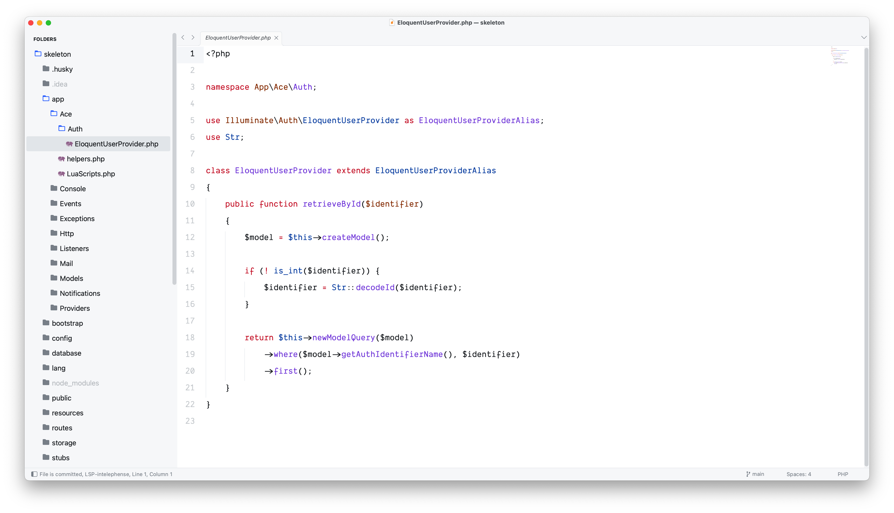
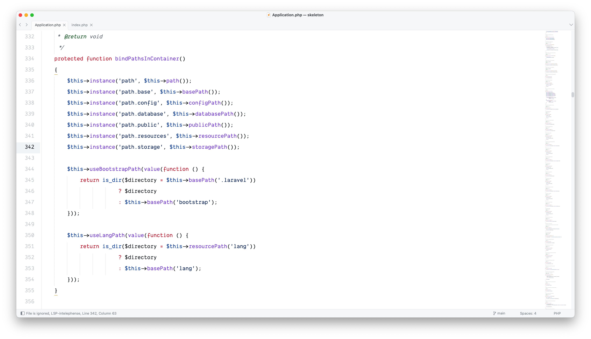

# Sublime Text Preferences

最终我还是用了 `Sublime Text 4`.

使用了 [`ayu`](https://github.com/dempfi/ayu) Theme 和 [`github-sublime-theme`](https://github.com/mauroreisvieira/github-sublime-theme) color scheme. 并对 `ayu` Theme 进行了一些自定义.

针对 PHP 使用了 [`LSP`](https://github.com/sublimelsp/LSP) 和 [`LSP-intelephense`](https://github.com/sublimelsp/LSP-intelephense)

其他插件如: 

1. [`MarkdownPreview`](https://github.com/facelessuser/MarkdownPreview)
2. [`SyncedSideBar`](https://github.com/TheSpyder/SyncedSideBar)
3. [`Terminus`](https://github.com/randy3k/Terminus)
4. [`GitGutter`](https://github.com/jisaacks/GitGutter)
5. [`PackageResourceViewer`](https://github.com/skuroda/PackageResourceViewer)
6. [`A File Icon`](https://github.com/SublimeText/AFileIcon)

[`Settings`](./Preferences.sublime-settings) & [`Keymap`](./x.sublime-keymap)

## Screenshot

## 后注
我又换回了vscode(为了生态)，vscode在 M2 Max 驱动下也可以秒开了。

